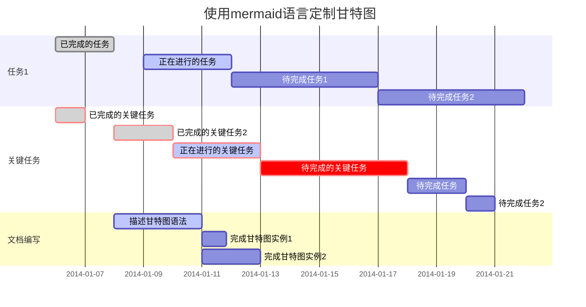

### 前言

目前免费证书的使用期限是90天，证书更新也从以前的一年一换变成了现在的三个月一换，本人自己域名加公司域名有近四十个之多，每次证书更新都是一个很费事又费时的工作，不得不进行自动化处理。

---

*斜体* **粗体** ***粗斜体***

<u>下划线</u> ~~删除线~~

<!--注释-->

[^aa]:前几天


* 1
* 2
* 3
* 5

> qhjfj
>
> ffdgdh
>
> > 123
> >
> > 243546
> >
> > > 2335454
> > >
> > > 6568
> > >
> > > > 56

```php
<?php echo 111>
```

[Aaa](https://www.runoob.com/markdown/md-link.html)

 

| 11   | 22   | 33   |
| ---- | ---- | ---- |
|      |      |      |
|      |      |      |
|      |      |      |

使用 <kbd>Ctrl</kbd>+<kbd>Alt</kbd>+<kbd>Del</kbd> 重启电脑

$$\sum_{i=0}^N\int_{a}^{b}g(t,i)\text{d}t$$
$$W_G^{mn}=max\{0,W_G.\xi_G(f_G^m,f_G^n)\}$$

$$
\begin{Bmatrix}
   a & b \\
   c & d \\ 
\end{Bmatrix}
$$
$$
\begin{CD}
   A @>a>> B\\
@VbVV @AAcA\\
   C @= D
\end{CD}
$$

$$\begin{bmatrix}
{a_{11}}&{a_{12}}&{\cdots}&{a_{1n}}\\
{a_{21}}&{a_{22}}&{\cdots}&{a_{2n}}\\
{\vdots}&{\vdots}&{\ddots}&{\vdots}\\
{a_{m1}}&{a_{m2}}&{\cdots}&{a_{mn}}\\
\end{bmatrix}$$

$$\begin{cases}
a_1x+b_1y+c_1z=d_1\\
a_2x+b_2y+c_2z=d_2\\
a_3x+b_3y+c_3z=d_3\\
\end{cases}$$


